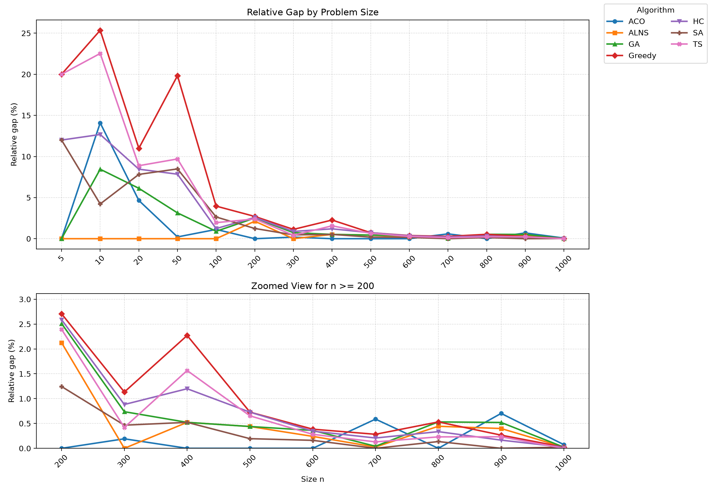

<h1 align=center>CBUS mini project</h1>

> [!NOTE]  
> This is a mini project  
> Course: Fundamentals of Optimization  

This repo represented 7 different ways to deal with CBUS - Capacitated Single-Vehicle Pickup-Delivery Problem

## Problem

`1` bus with capacity `k` is used for transporting `n` passengers `1, 2, ..., n`. Each passenger `i` wants to travel from point `i` to point `i+n`. Passengers must be served such that the bus's load does not exceed the limit `k`. The bus starting from `0` served all passenger, then back to `0`.

## Folder Structure

```
.
├── assets
│   └── ...                     # assets files
├── cfg
│   ├── config.yaml
│   └── test
│       └── ...                 # config for each test
├── data
│   └── ...
│       └── task.inp            # test input for each folder
├── main.py
├── README.md
├── requirements.txt
├── src
│   └── ...                     # algorithms code lies in here
└── utils
    └── ...                     # utils function
```

## Algorithm

### Heuristic and Meta-heuristic
- Ant Colony Optimization
- Adaptive Large Neighborhood Search
- Genetic Algorithm
- Greedy
- Hill Climbing
- Simulated Annealing
- Tabu Search

### Exact Methods
- Branch and Bound
- Bitmask Dynamic Programming
- CP-SAT using ortools

## Results

We tested 7 algorithms (heuristic and meta-heuristic) on multiple size test range from 1 to 1000  
More specific: 5, 10, 20, 50, 100, 200, 300, 400, 500, 600, 700, 800, 900, 1000  

<h3 align=center>Table 1. Score Relative Gaps(%) Comparison. Lower is better</h3>

  

<h3 align=center>Figure 1. Visualization of Table 1.</h3>



## Installation

Create a virtual enviroment:
```
python -m venv env
```

Activate it (for bash users):
```
source env/bin/activate
```

Install requirements:
```
pip install -r requirements.txt
```

## Running Test

If you want to run the test by yourself, you can run:  
```
python main.py
```

## Build a different test

Run:  
```
python utils/test_builder.py seed={newseed}
``` 
to generate a new test with `newseed` *without the brackets {}*.  
Default seed: 0  