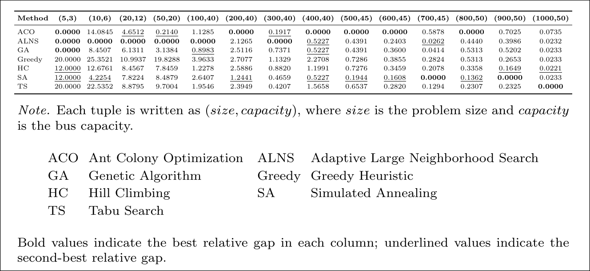

# CBUS mini project

> This is a mini project  
> Course: Fundamentals of Optimization  

This repo represented 7 different ways to deal with CBUS - Capacitated Single-Vehicle Pickup-Delivery Problem

## Folder Structure

```
.
├── assets
│   └── ...                     # assets files
├── cfg
│   ├── config.yaml
│   └── test
│       └── ...                 # config for each test
├── data
│   └── ...
│       └── task.inp            # test input for each folder
├── main.py
├── README.md
├── requirements.txt
├── src
│   └── ...                     # algorithms code lies in here
└── utils
    └── ...                     # utils function
```

## Algorithm

- Ant Colony Optimization
- Adaptive Large Neighborhood Search
- Genetic Algorithm
- Greedy
- Hill Climbing
- Simulated Annealing
- Tabu Search

## Results

We tested 7 algorithms on multiple size test range from 1 to 1000  
More specific: 5, 10, 20, 50, 100, 200, 300, 400, 500, 600, 700, 800, 900, 1000  

Table 1. Score Relative Gaps(%) Comparison. Lower is better
  

## Installation

- `python -m venv env`
- `source env/bin/activate`
- `pip install -r requirements.txt`

## Running Test
- `python main.py`

## Build a different test

You can change the seed in `cfg/config.yaml` to set a new seed.  
Then run `python utils/test_builder.py` to generate a new test.  
Default seed: 42  